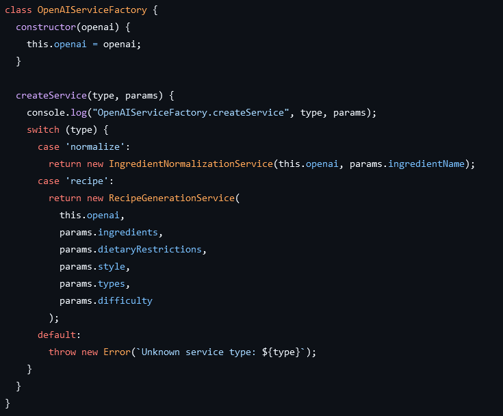
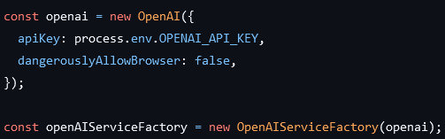
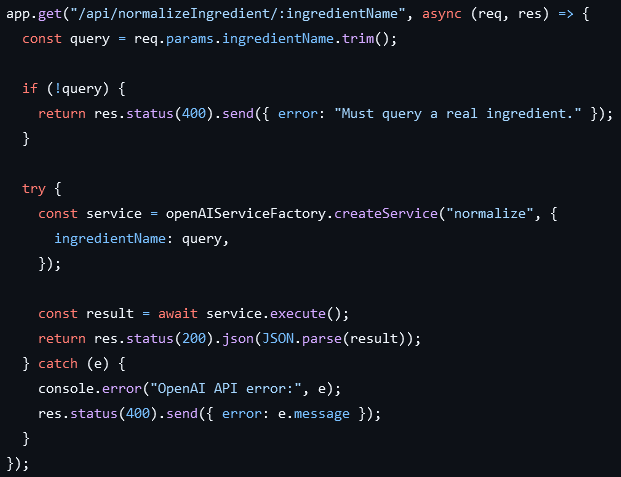
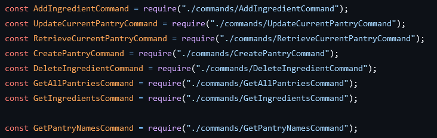
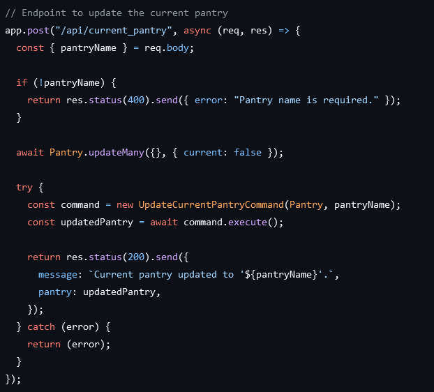
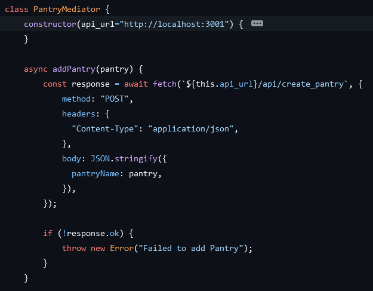
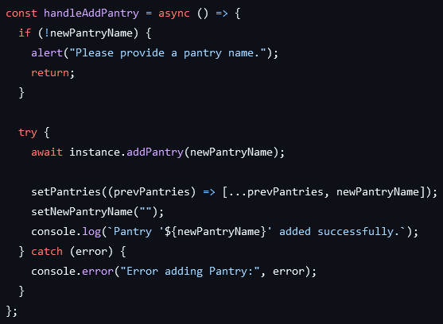

# Background
The RecipeBuilder application's concept began as an idea to use the power of GPT-4o to devise recipes using leftover ingredients and avoid food waste. Following an expansion of scope, the application also encompassed the management of ingredient lists (called pantries), the ability to search for new ingredients, the ability to apply dietary restrictions, style preferences, meal types, and preparation difficulties to generated recipes, and the ability to suggest additional ingredients if the given ones are not enough to cook something coherent. We aimed to implement all aspects of a web application that could perform these tasks quickly, cheaply, intuitively, and effectively.
When we were considering our tech stack, we immediately chose to use React.js again when implementing our frontend, as we were all experienced with it and found it to be easy to use in Project 1. However, frustrations with implementing the backend with Springboot lead us to switch to Node.js and Express.js. We also identified the need for a database technology to store all of our ingredient lists as opposed to static on-server storage within a variable and chose MongoDB. In addition, we had to use the OpenAI API to generate recipes, as well as the Google Cloud Platform to deploy the application.
# Technologies
# Requirements
For this project, we chose four Minimum Marketable Features (MMFs) to focus on, and based the vast majority of our development around polishing these.
1. An interactive virtual pantry that can list and categorize a user's ingredients.
This took the form of a page in which users were capable of creating new ingredient lists (pantries), viewing the ingredients within each one, adding and removing ingredients manually, and deleting a pantry itself.
2. An AI-powered ingredient search that can suggest ingredients based on a user's query.
This took the form of a page in which users could input the name of an ingredient and receive an AI-generated category for that ingredient as well as three related ingredients.
3. An AI-powered recipe generator that can derive a recipe from a user's available ingredients.
This took the form of a page that would send an engineered prompt to the OpenAI API from the backend that would query a recipe using a pantry's ingredients.
4. An interface to tune a recipe's generation based on dietary restrictions, style, meal type, and difficulty.
This took the form of several dropdowns on the recipe generation page that would add additional caveats to the engineered prompt on the backend.
# Design
# Design Patterns
## Factory
The first pattern we decided to implement was the Factory pattern in our backend code. We made this decision when it became apparent that the AI-related code was significantly different from the pantry operations, and was causing a great deal of clutter. It enabled us to delegate the responsibility of handling endpoints that would query the OpenAI API to a specific object, letting the rest of the code focus more on pantry management. It also allowed us to streamline the assembly of API queries. This made the project's backend simpler to manage by way of keeping the focus of each file abundantly clear. If anyone wanted to adjust the AI's prompts, they would know exactly where to look, and would not have to alter the functionality of the base file.

*The factory's internal logic to determine what service to create.*

*The factory being created in the main backend file.*

*The API endpoint's use of the factory to generate an executable service.*
## Command
The next pattern that we implemented was the Command pattern in our backend code. We made this decision when it became apparent that our choice of MongoDB was ill-advised, and any extensions of this project would benefit from a switch to something else. It enabled us to separate our own API's endpoints from the execution of database operations. This meant that if we were to, for example, switch to another database management system or add another type of client with different reasons to perform the same database operation, we would not have to copy code. Instead, we could simply call the commands.

*Importing the commands from a folder into the main backend file.*

*Using one of the commands in an API endpoint.*
## Mediator
The final pattern to see implementation was the Mediator pattern on the frontend. We observed that if we wanted to alter the API request format on the frontend, we would have to perform shotgun surgery on every single potential request. Instead, we decided to localize these requests to a single mediator object that could be modified alone. This enabled us to modify API requests in one place. We also decided to implement this as a Singleton, as this would allow the class itself to initialize an instance with an environment variable of the expected API endpoint URL, enabling the rest of the code to more or less ignore context switches.

*One of the mediator's functions within its class file.*

*The mediator's function being used within an API call on the frontend.*
# Testing
# Challenges/Innovations
# Outcomes
# Future Direction